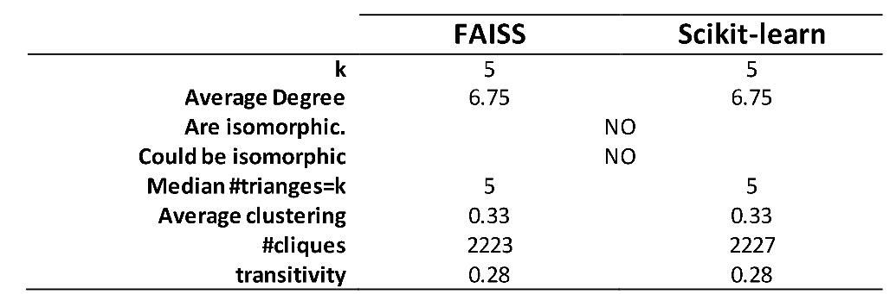

% Joint Analysis of geospatial and "friendship" of Gowalla data
% Juan Benjumea
% jubenjum@gmail.com

# Outline 

## Data Presentation  
* Gowalla and Google Places 

## Data processing

## Understanding the data

## Prediction methodology

## KNN-G cross validation

## KNN-G results for Gowalla

## Conclusions 

------------------

# Outline

From: ***Data iku***
https://blog.dataiku.com/2016/07/06/fundamental-steps-data-project-success

---

# Data Presentation 1/2

## keypoints Gowalla-Stanfor data:
    
- undirected social network graph database [clean]
- selected fields: user, check-in timestamp and position, 
            spot, user friendship links 
- from 02/2009 to 10/2010
- ~6 Million check-ins and >100000 single users 
- Multiple cities in US and include Paris (turistic)
- Paris data: 17496 check-ins (1 year data from 09/2009)

---

# Data Presentation 2/2

## keypoints Google Places
    
- Web Service API that returns JSON objects (used only `nearbysearch`) 
- Not 100% clean
- Limited to 1000 queries/day: batch and optimization of queries
- more info at http://developers.google.com/plaes/webservice/search

##  other sources:

- OpenstreetMap webservice to get geographical features (JSON objects)

---

# Data processing 1/2

## Gowalla
- selected ***users*** and check-in ***positions*** around 30km Paris
- Data is clean and in csv format
- 17496 check-ins, 1366 users

## Google
- Selected all unique locations (4178) in Gowalla-Paris 
  and requesting around 100m in Google Places
- Request all types of venues: hotels, monuments, shops, etc
- 30286 points of interest, 23074 after data cleaning 
- extracted: ***locations***, ***place-ids***, ***names*** 
  and ***types*** 
- each ***location*** contains different ***types***, 
  ***types*** were cleaned and projected from binary 
  feature space with $d=128$

---

# Data processing 2/2

---

# Understanding the data 1/2

---

# Understanding the data 2/2

---

# Feature Engeniering 1/2

## Tools

- Web-fetching and data preprocesing and 
  cleaning, with ***\*nix***: bash, wget, awk, seed.
  +Efficient & -Work for the size of databases (<1G data)
- Data analysis with python/C++:
    - data management with pandas
    - ML with scikit-learn and FAISS
    - data analysis with scikit and networkx
    - visualization with matplotlib and networkx
- General project versioning with git (https://github.com/jubenjum/dssp5-proj)

---

# Feature Engeniering 2/2

## Features

Gowalla data $\rightarrow$ Google Places types

***Signature*** ~ people preferences

---

# KNN-G cross validation

***Objective***: cross validation of FAISS and scikit-learn KNN-graph on CPU
using Gowalla-Paris  data

---

# KNN-G results for Gowalla

- **K=50** friends using L2 similarty metric

- Local friends visits 2102 spots (#recommendations)
- Tourist friends visits 2272 spots (#recommendations) 

---

# Conclusions & Future work 

- It does exist patterns in check-ins in time and location
- It is possilbe to build a recommendation system that learns from the 
  patterns of check-ins

- It could be interesting to test different hyper-parameter and 
different metrics (cosine)
- Explore the GPU capabilities of FAISS

